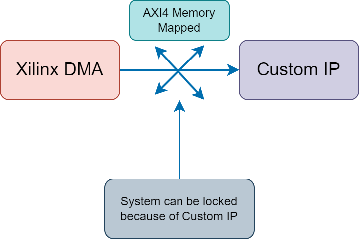
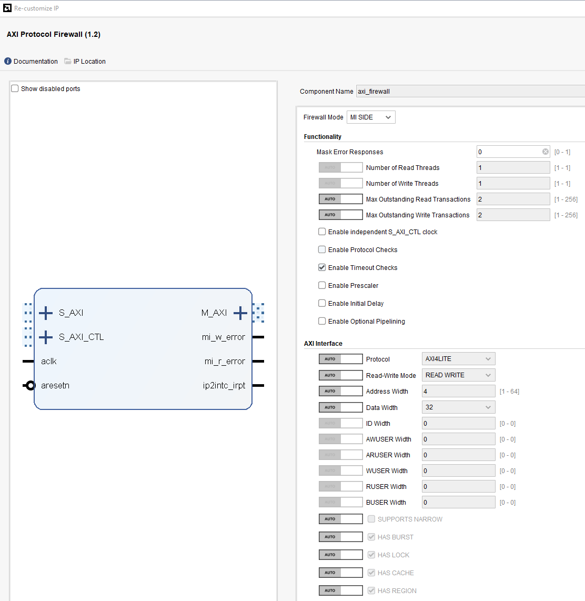
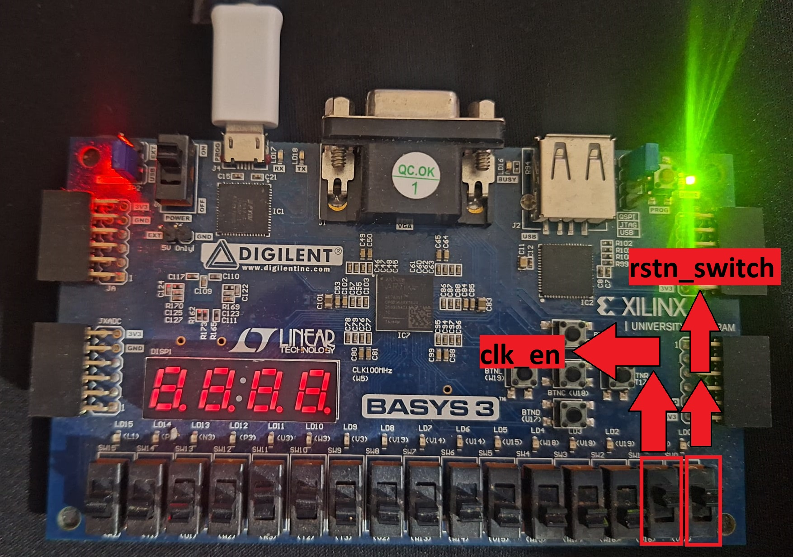

# Xilinx AXI Protocol Firewall IP

Yazının amacı Xilinx AXI Firewall IP'yi tanıtmak ve `Zaman Aşımı Koruma (Enable Timeout Checks)` özelliğini örnek bir proje ile göstermektir. Öncelikle IP'yi tanımakta fayda var.

## AXI Firewall IP’nin Amacı

AXI Firewall IP, AXI arayüzünde veri transferi yaşanırken kritik bir köprü görevi görür ve hatalı veri transferlerinden kaynaklanacak problemlerin projenin diğer bölümlerini etkilemesini önler. Zaten `Firewall`, kelime anlamı itibariyle de `Güvenlik Duvarı` demek. Ayrıca AXI3, AXI4 ve AXI4-Lite arayüzlerini desteklemektedir.

Örneğin; bir DMA (Direct Memory Access) IP kullandığımızı düşünelim. Bu DMA IP'si veriyi, custom yazılmış bir IP'ye AXI arayüzü ile gönderiyor. Bu durumda eğer protokol hatası varsa veya bir süre custom IP cevap veremezse tüm DMA IP'ye bağlı veri hattı kilitlenebilir. Verilen örneğe ait bir figür aşağıdadır:



AXI Firewall, böyle bir durumda söz konusu hatalı veri transferini tespit edip durdurur. AXI trafiğini master ve slave arayüzleri arasında iletirken, gerçekleşebilecek protokol ihlallerini veya timeout olma gibi durumları aktif olarak kontrol eder ve sorunlu veri transferlerini bloke eder. Aşağıda örnek bir figür bulunmaktadır:


Yukarıdaki figürden de görüleceği üzer AXI Firewall IP sayesinde projenin geri kalan kısmı fonksiyonel olarak zarar görmeden çalışmaya devam eder. Yani AXI Firewall IP, AXI veri hattı üzerinde güvenlik duvarı görevi görerek, bir taraftaki ihlal veya kilitlenmenin projenin diğer kısımlarına yayılmasını engeller.

## AXI Firewall IP'nin Genel Özellikleri

AXI Firewall IP'nin genel olarak belirgin özellikleri aşağıda listelenmiştir. IP'nin register haritası bulunmaktadır ve bu register haritası AXI4-Lite arayüzünden kontrol edilebilmektedir. Register haritasının kontrol edildiği AXI4-Lite arayüzü ile firewall kontrolünün yapılabildiği AXI4-Lite arayüzü birbirindne farklıdır:

- AXI3/AXI4/AXI4-Lite desteği: IP, farklı AXI arayüzlerini destekler.
- Timeout koruması: Transferlerin beklenen sürede tamamlanmaması durumunda bu durumu hata gibi görebilir.
- Protokol ihlali koruması: AMBA/AXI protokolüne aykırı bir durum oluştuğunda (örneğin beklenmeyen sinyal gelmesi, beklenmeyen handshake durumunun yaşanması... gibi) hatalı veri transferini durdurarak projenin fonksiyonelliğini korur.
- AXI4-Lite Register ile Durdurup/Başlatma: AXI4-Lite register arayüzü üzerinden AXI Firewall IP manuel olarak durdurulup başlatılabilir.
- AXI4-Lite Register Status/Interrupt: Bloklanan bir hatanın nedenini öğrenmek için ilgili status bilgileri IP içerisinde tutulur. Ayrıca interrupt açılıp kapatılabilir. IP'nin interrupt portu da bulunmaktadır.

## AXI Firewall IP Ayarları

Aşağıda 1.2 versiyonuna ait IP ayarları bulunmaktadır:



Ayarların aşağısındaki `AXI Interface` kısmında ilgili AXI arayüzü ile ilgili ayarlar yapılır.

Yukarıda `Functionality` kısmındaki belli başlı ayarların tanımları aşağıda farklı başlıklar altında listelenmiştir. AXI Firewall IP `Master` veya `Slave` arayüzlerinde kullanılabilir.

### Number of Read Threads

Aynı anda gerçekleşebilecek maksimum okuma işlemi sayısını belirler. Aynı anda birden fazla okuma işlemini destekleyen sistemlerde faydalıdır.

### Number of Write Threads

Aynı anda gerçekleşebilecek maksimum yazma işlemi sayısını belirler. Eş zamanlı veri yazımı gerektiren uygulamalarda kullanılır.

### Max Outstanding Read Transactions

Cevap bekleyen maksimum okuma işlemi sayısını sınırlamak için kullanılır. Memory erişimlerinin yönetimini kolaylaştırır.

### Max Outstanding Write Transactions

Cevap bekleyen maksimum yazma işlemi sayısını sınırlamak için kullanılır. Yoğun veri yazma işlemlerinde sistemin aşırı yüklenmesini önler.

### Enable independent S_AXI_CTL clock

Bu seçenek etkinleştirildiğinde IP’nin AXI4-Lite register arayüzü (S_AXI_CTL) için ayrı bir clock domain kullanılabilmektedir. Etkinleştirilmediğinde IP tümüyle `aclk` clock domain'i ile çalışmaktadır.

### Enable Protocol Checks

Bu özelliğin amacı, AXI protokol kurallarının ihlal edilip edilmediğini kontrol edebilmektir. IP, her AXI transferinde AMBA/AXI protokolünde tanımlı kurallarını denetler. Eğer bir veri transfer protokol ihlali yaşanırsa bu hatalı veri akışı engellenir ve durdurulur.

Örneğin; bir okuma isteği gönderilip karşı taraftan hiç veri gelmiyorsa veya yanlış adres bilgisi gelmişse bu bir ihlal olarak algılanabilir.

### Enable Timeout Checks

AXI veri akışında bir transferin beklenen sürede tamamlanmaması veya tamamlanamaması durumunda zaman aşımı gerçekleşir. Bu seçenek etkinse, her bir veri transferi için süre sınırı kontrolü yapılır. Bir transfer, ayarlanan süre içinde (AXI4-Lite register arayüzü ile ayarlanabilir) tamamlanmazsa (örneğin bir okuma komutuna yanıt gelmezse) bu durum hata olarak sayılır. AXI Firewall IP, söz konusu transferi bloke ederek tüm projeyi kilitlemek yerine geri kalan trafiğin devam etmesini sağlar.

Demo proje kapsamında bu özellik etkinleştirilmiş ve interrupt arayüzü ile (callback fonksiyonundan da yararlanılarak) kullanılmıştır.

### Enable Prescaler

Prescaler, timeout kontrol edilirken kullanılan sayaç değerini genişletmek için kullanılır. Bu ayar açıkken, timeout sayaçları her artışta sadece 1 artmak yerine belirli sayıda clock cycle sayarak ilerler. Örneğin prescaler değeri n ise, sayaç her (n+1) cycle'da bir kez artar. Bu değer AXI4-Lite register arayüzü ile belirlenebilir.

Bu özellik sayesinde timeout süresini çok daha uzun hale getirmek mümkün. Bu özellik, eğer timeout değeri olarak çok çok fazla bir değer atanmak isteniyorsa açılmalıdır.

### Initial Delay

Bu seçenek, sistem resetlendikten sonra timeout sayaçlarının çalışmaya başlamadan önce geçecek clock cycle sayısını belirler. Bu özellik açıkken, IP reset durumundan çıktıktan sonra belirlenen süre boyunca sayaçlar duraklatılır. Bu değer AXI4-Lite register arayüzü ile değiştirilebilir (özellik açık olduğu durumda).

Bu özellik, örneğin FPGA açıldıktan sonra hazır olması için kısa bir süre beklemek istediğinizde faydalıdır. İlk gecikme boyunca timeout sayacı sıfır saymaya devam eder ve belirlenen süre bitince normal sayaç işlemi başlar.

### Enable Optional Pipelining

Bu seçenek sayesinde IP'ye pipeline eklenmesine izin verilir. Bu özellik, veri yolundaki sinyallerin daha hızlı iletilmesine yardımcı olarak tasarımın yüksek clock hızlarında stabil çalışmasını kolaylaştırır. Açık olması durumunda FPGA'de daha fazla yer kaplar.

## Demo Proje

Bu demo projede AXI Firewall IP’nin timeout kontrol özelliğinin çalışması Basys3 FPGA kartı üzerinde uygulamalı olarak gösterilmiştir. Demo projenin temel amacı, AXI Firewall IP’nin kritik durumlarda nasıl devreye girdiğini ve sistem kararlılığını nasıl koruduğunu göstermektir.

Aşağıda projenin blok tasarımına ait görsel bulunmaktadır:


### Projenin Genel Yapısı

Projede kullanılan FPGA kartı Digilent Basys3’tür. Tasarımda iki önemli giriş sinyali olan `clk_en` ve `rstn_switch` demo kart üzerindeki fiziksel switchlere bağlanmıştır. `rstn_switch` active-low sistem reset gibi düşünülebilir. `clk_en` ise `AXI UartLite IP`'ye giden clock'u kapatıp açabilir.

Sistem içerisinde MicroBlaze IP, AXI Firewall IP ve AXI UartLite IP'leri bulunmaktadır. MicroBlaze içerisinde Vitis kodu sayesinde saniyede 1 olacak şekilde sürekli olarak UART üzerinden veri gönderme işlemi çalışır. AXI Firewall IP bu veri akışını (AXI Protokolü ile gerçekleşen veri akışı) izleyerek timeout durumlarını kontrol eder. Çok basit olarak projedeki ana mimari aşağıda verilmiştir:


Firewall IP'nin FPGA üzerinde kapladığı alan aşağıda verilmiştir:

- 676 LUTs
- 677 FFs
- 1 LUTRAM

### Demo Projede Senaryo

Başlangıç kısmında Vitis kodunda Microblaze interrupt açılır ve callback oluşturulur. Ayrıca AXI Firewall IP'nin interrupt'ları açılır.

Proje şu temel senaryoyu uygular:

- Başlangıçta (Microblaze de ayağa kalktıktan sonra), sistem normal çalışırken UART üzerinden düzenli veri gönderimi gerçekleşir ve Firewall IP sessizce işlemleri izler.
- FPGA üzerindeki **clk_en** switch'i 0 konumuna getirildiğinde, AXI UartLite modülüne gelen clock sinyali kesilir. Bu durum, UartLite IP’nin normal çalışmasını durdurur ve bekleyen AXI veri transferlerinin tamamlanmasını engeller.
- Bu noktada, AXI Firewall IP timeout mekanizmasını tetikler. Timeout durumu gerçekleştiğinde Firewall IP tarafından bir interrupt sinyali oluşturulur ve Microblaze IP'ye iletilir.
- Oluşturulan interrupt, MicroBlaze IP üzerinde tanımlanmış bir callback fonksiyonunu devreye sokar. Bu callback fonksiyonu içinde, AXI veri akışını kesme, Firewall IP’yi yeniden etkinleştirme (`MI-Side Unblock Control Register` olarak tanımlanmış register 1 sürülür).
- Timeout durumu devam ettiği sürece callback fonksiyonu sürekli devreye sokulur. Bu durumdan çıkmak için `clk_en` switch'i 1 yapılmalıdır.

İlgili callback fonksiyonu aşağıda verilmiştir:

```c
// Callback Function
void MyInterruptHandler() {
    // Enable Firewall
	Xil_Out32(XPAR_AXI_FIREWALL_0_BASEADDR + 0x8, 0x1);

    // Print
    xil_printf("Executing Callback Function.\r\n");

    // Wait for a while
    sleep(1);
}
```

### Demo Projenin Çalıştırılması

Karta kodu attıktan sonra `Hercules` açılır ve UART hattına bağlanılır. Aşağıdaki gibi bir sayaç saymaya başlar.


Tam `Counter value: 6` olduğu noktada aşağıdaki fotoğrafta `clk_en` olarak tanımlanmış switch 0 konumuna getirilmiştir. Bu senaryo sonrası Hercules üzerinde herhangi bir veri yazılamaz çünkü sistem sürekli callback'e girer.



Sonrasında tekrar `clk_en` switch'i 1 konumuna getirildiğinde kod kaldığı yerden devam eder:


## Son Notlar

Bu demo proje, AXI Firewall IP’nin sistem güvenliği açısından ne kadar kritik olduğunu açıkça ortaya koymaktadır. Timeout gibi sorunların sistemde daha büyük sorunlara yol açmasını engeller. Böylece sistemin kesintisiz ve güvenli çalışmasını sağlar.

Bu uygulama sayesinde, AXI Firewall IP'nin timeout kontrollerinin gerçek hayatta karşılaşabileceğimiz sorunlara pratik bir çözüm olduğunu net biçimde görebilmekteyiz.
