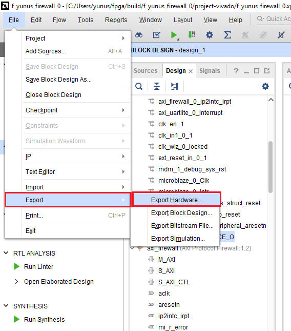

# Vivado Project Creation

To build project from scratch, `fusesoc` library is utilized. Required tools for FPGA project creation via `fusesoc`:

- Vivado 2024.1  
- pip  
- make  
- fusesoc  

## Project Setup Steps

Open terminal (Linux) or cmd (Windows) inside cloned repo’s `fpga` folder. Then, source Vivado installation (Windows example):

```bash
D:\Xilinx\Vivado\2024.1\settings64.bat
```

Next, run two commands below to generate makefiles used for project setup:

```bash
fusesoc library add firewall .
fusesoc run --target=project --setup firewall
```

Use `cd` to enter build output folder where `Makefile` resides and run `make` command below:

```bash
cd build\f_yunus_firewall_0\project-vivado
make build-gui
```

At this point, FPGA project can be synthesized. After synthesis, if creating a Vitis project, export `.xsa` file by clicking option shown in figure below:



Then, in Output settings, enable `Include Bitstream`, set export folder to `sw`, and name file `design_1_wrapper.xsa`.
