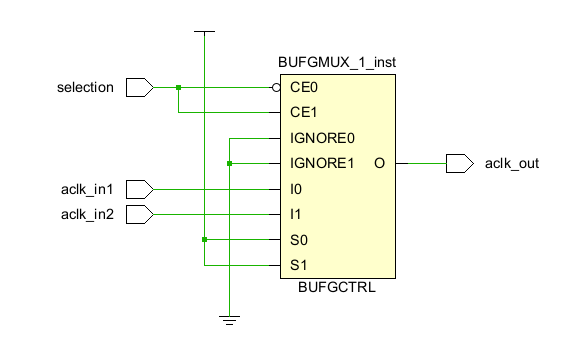
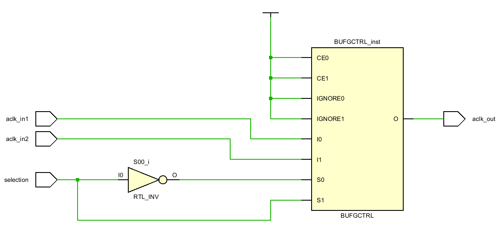

# Clock Muxlar

Clock mux yapabilmek için farklı yöntemler mevcut. Mux işlemi asynchronous ve synchronous clocklar için yapılabilir. Mux yaparken bazı tasarımlarda glitch olmamasına dikkat etmek gerekebilir. Bu yüzden bu yazıda farklı clock mux yöntemleri ve özelliklerine yer verilmiştir.

Glitch, clock mux anında oluşabilecek istenmeyen kısa pulse'lar şeklinde tanımlanabilir. Kontrollü bir clock değiştirme olmadığı durumda glitch meydana gelebilir. Bu durum setup ve hold timing konusunda problemlere sebep olabilir. Ayrıca tasarımın çalışması etkilenebilir.

Tüm kütüphane testbenchlerde 50 MHz ve 75 MHz olmak üzere iki farklı clock üretiliyor. Bunlar asynchronous olarak görülebilir.

## Kod ile Mux Tasarımı

### Glitch İçerebilen Tasarım

Glitch içeren tasarımda combinatorial olarak clock geçişi yapılır. Herhangi bir control söz konusu değildir. Aşağıda kod parçası verilmiştir:

```verilog
module user_glitch_mux(
        input   aclk_in1,
        input   aclk_in2,
        output  aclk_out,
        input   selection
    );

    assign  aclk_out    =   !selection  ?   aclk_in1    :   aclk_in2;

endmodule
```

Yukarıdaki tasarım testbench üzerinde test edildiğinde aşağıdaki gibi glitch elde edilebilir:


### Glitch-free Tasarım

Glitch-free tasarım için [bu linkte](https://vlsitutorials.com/glitch-free-clock-mux/) tanımlanan yapıdan yararlanıldı. Burada `selection` sinyali iki clock domain'de 2-stage flip-flop ile senkronlanıyor ve clock mux olayı senkronlanan çıktılara göre yapılıyor. Bu şekilde glitch olmaksızın bir sonuç görmek mümkün. Bu yapı için aşağıda kod parçası verilmiştir:

```verilog
module user_glitchless_mux(
        input   aclk_in1,
        input   aclk_in2,
        output  aclk_out,
        input   selection
    );


    // Clock domain synchronization flip-flops for clock domain 1
    reg sel_sync_ff1_clk1 = 1'b0; // First stage flip-flop in clock domain 1
    reg sel_sync_ff2_clk1 = 1'b0; // Second stage flip-flop in clock domain 1

    // Clock domain synchronization flip-flops for clock domain 2
    reg sel_sync_ff1_clk2 = 1'b0; // First stage flip-flop in clock domain 2
    reg sel_sync_ff2_clk2 = 1'b0; // Second stage flip-flop in clock domain 2

    // Synchronization logic for clock domain 1
    always @(posedge aclk_in1) begin
        sel_sync_ff1_clk1 <= !sel_sync_ff2_clk2 && !selection;  // Sync selection signal
        sel_sync_ff2_clk1 <= sel_sync_ff1_clk1;                 // Propagate to second stage
    end

    // Synchronization logic for clock domain 2
    always @(posedge aclk_in2) begin
        sel_sync_ff1_clk2 <= !sel_sync_ff2_clk1 && selection;   // Sync inverted selection signal
        sel_sync_ff2_clk2 <= sel_sync_ff1_clk2;                 // Propagate to second stage
    end

    // Output logic
    assign aclk_out = (sel_sync_ff2_clk1 && aclk_in1) || (sel_sync_ff2_clk2 && aclk_in2);


endmodule
```

Yukarıdaki tasarım testbench üzerinde test edildiğinde aşağıdaki gibi glitch-free bir sonuç elde edilebilir:


## Xilinx Primitiveler ile Mux Tasarımı

Örnek olması açısından Basys-3 (Aritx-7) kartını kullandım. Bu yüzden, bu başlıkta Artix-7 kapsamında Xilinx'in sunduğu clock muxlardan bahsedilmiştir. Bu clock muxlar arka planda `BUFGCTRL` primitive'ini kullanmaktadır. Primitive üzerindeki belli başlı portların sürülmesinde değişiklikler olmaktadır. Bu değişikliklerden kaynaklı olarak glitch içerebilen veya glitch-free tasarımlar ortaya çıkabilmektedir.

Bu primitive'in portları ve ne işe yaradığı ile ilgili bilgi aşağıda tablo şeklinde verilmiştir (**x** ile yazılan kısımlar 0 veya 1 değerlerini temsil etmektedir):

| Port İsmi | Açıklama |
| :-------- | :------- |
| CEx       | Ix input clock için clock enable sinyali. Kullanım olarak Sx portu ile aynı işleve sahip. Tek fark olarak setup/hold gereksinimi var ve bunun sağlanmaması durumunda glitch oluşabiliyor. Fakat bu yazı kapsamında setup/hold sağlanmaktadır. Selection sinyali bu porta bağlanacaksa SEx portları 1 sürülmelidir. |
| SEx       | CEx kısmına yazılan açıklamaya bakılmalıdır. |
| IGNOREx   | Bu değerin 1 olması durumunda switching ani bir şekilde yapılır, bu yüzden gltich'e sebep olabilir. |
|Ix         | Clock sinyallerini belirtmektedir. |
| O         | Clock output |

### BUFGMUX_CTRL

Xilinx'in sağladığı bu kütüphane, glitch-free bir tasarımı garanti etmektedir. Bu primitive'i kullanmak için yazılan kod parçası aşağıda verilmiştir:

```verilog
module user_bufgmux_ctrl(
        input   aclk_in1,
        input   aclk_in2,
        output  aclk_out,
        input   selection
    );


   // BUFGMUX_CTRL: 2-to-1 Global Clock MUX Buffer
   //               Artix-7
   // Xilinx HDL Language Template, version 2024.1

   BUFGMUX_CTRL BUFGMUX_CTRL_inst (
      .O    ( aclk_out  ),  // 1-bit output: Clock output
      .I0   ( aclk_in1  ),  // 1-bit input: Clock input (S=0)
      .I1   ( aclk_in2  ),  // 1-bit input: Clock input (S=1)
      .S    ( selection )   // 1-bit input: Clock select
   );

   // End of BUFGMUX_CTRL_inst instantiation

endmodule
```

Vivado üzerindeki Schematic üzerinden bakıldığında `BUFGCTRL` primitive portları aşağıdaki gibi gözükmektedir:


Yukarıdaki tasarım testbench üzerinde test edildiğinde aşağıdaki gibi glitch-free bir sonuç elde edilebilir:


### BUFGMUX

Xilinx'in sağladığı bu kütüphane, glitch-free bir tasarımı garanti etmektedir. Bu primitive'i kullanmak için yazılan kod parçası aşağıda verilmiştir:

```verilog
module user_bufgmux(
        input   aclk_in1,
        input   aclk_in2,
        output  aclk_out,
        input   selection
    );


   // BUFGMUX: Global Clock Mux Buffer
   //          Artix-7
   // Xilinx HDL Language Template, version 2024.1

   BUFGMUX #(
   )
   BUFGMUX_inst (
      .O    ( aclk_out  ),  // 1-bit output: Clock output
      .I0   ( aclk_in1  ),  // 1-bit input: Clock input (S=0)
      .I1   ( aclk_in2  ),  // 1-bit input: Clock input (S=1)
      .S    ( selection )   // 1-bit input: Clock select
   );

   // End of BUFGMUX_inst instantiation


endmodule
```

Vivado üzerindeki Schematic üzerinden bakıldığında `BUFGCTRL` primitive portları aşağıdaki gibi gözükmektedir:


Yukarıdaki tasarım testbench üzerinde test edildiğinde aşağıdaki gibi glitch-free bir sonuç elde edilebilir:


### BUFGMUX1

Xilinx'in sağladığı bu kütüphane, glitch-free bir tasarımı garanti etmektedir ama diğer muxlardan başka reaksiyon göstermektedir. Aşağıdaki görsellerde de bu durum gözükmektedir. Ne zaman `selection` transition'ı yapılırsa yapılsın clock high zamanı değişken olmakta fakat glitch denilebilecek seviyede bir pulse oluşmamaktadır. Bunun sebebi `Truth table` açısından diğer çözümlerden farklı olması. Bu durum glitch olarak belirtilmiyor. BUFGMUX ve diğer glitch-free yöntemlerin aksine, clock geçişleri sırasında çıkışı düşük (low) tutan tasarımlardan farklı olarak, BUFGMUX_1 çıkışı yeni clock girişine geçiş yapılana kadar yüksek (high) seviyede tutar. Bu davranış, geçiş sırasında çıkışın yüksek kalmasının tercih edildiği tasarımlar için kullanışlıdır. Bu primitive'i kullanmak için yazılan kod parçası aşağıda verilmiştir:

```verilog
module user_bufgmux1(
        input   aclk_in1,
        input   aclk_in2,
        output  aclk_out,
        input   selection
    );


   // BUFGMUX_1: Global Clock Mux Buffer with Output State 1
   //            Artix-7
   // Xilinx HDL Language Template, version 2024.1

   BUFGMUX_1 #(
   )
   BUFGMUX_1_inst (
      .O    ( aclk_out  ),  // 1-bit output: Clock output
      .I0   ( aclk_in1  ),  // 1-bit input: Clock input (S=0)
      .I1   ( aclk_in2  ),  // 1-bit input: Clock input (S=1)
      .S    ( selection )   // 1-bit input: Clock select
   );

   // End of BUFGMUX_1_inst instantiation


endmodule
```

Vivado üzerindeki Schematic üzerinden bakıldığında `BUFGCTRL` primitive portları aşağıdaki gibi gözükmektedir:



Yukarıdaki tasarım testbench üzerinde test edildiğinde aşağıdaki gibi bir sonuç elde edilebilir:


### BUFGCTRL

Xilinx'in sağladığı bu kütüphane, `BUFGCTRL` primitive portlarının tümünü sürme imkanı sağlamaktadır. Bu yönden hem glitch içerebilen hem de glitch-free tasarımlar yapmak mümkün.

#### Glitch İçerebilen BUFGCTRL Tasarımı

Xilinx'in sağladığı bu kütüphane, glitch-free bir tasarımı garanti etmemektedir. Bu primitive'i kullanmak için yazılan kod parçası aşağıda verilmiştir:

```verilog
module user_glitch_bufgctrl(
        input   aclk_in1,
        input   aclk_in2,
        output  aclk_out,
        input   selection
    );


   // BUFGCTRL: Global Clock Control Buffer
   //           Artix-7
   // Xilinx HDL Language Template, version 2024.1

   BUFGCTRL #(
      .INIT_OUT     ( 0         ),  // Initial value of BUFGCTRL output ($VALUES;)
      .PRESELECT_I0 ( "FALSE"   ),  // BUFGCTRL output uses I0 input ($VALUES;)
      .PRESELECT_I1 ( "FALSE"   )   // BUFGCTRL output uses I1 input ($VALUES;)
   )
   BUFGCTRL_inst (
      .O        ( aclk_out      ),  // 1-bit output: Clock output
      .CE0      ( 1'b1          ),  // 1-bit input: Clock enable input for I0
      .CE1      ( 1'b1          ),  // 1-bit input: Clock enable input for I1
      .I0       ( aclk_in1      ),  // 1-bit input: Primary clock
      .I1       ( aclk_in2      ),  // 1-bit input: Secondary clock
      .IGNORE0  ( 1'b1          ),  // 1-bit input: Clock ignore input for I0
      .IGNORE1  ( 1'b1          ),  // 1-bit input: Clock ignore input for I1
      .S0       ( !selection    ),  // 1-bit input: Clock select for I0
      .S1       ( selection     )   // 1-bit input: Clock select for I1
   );

   // End of BUFGCTRL_inst instantiation


endmodule
```

Vivado üzerindeki Schematic üzerinden bakıldığında `BUFGCTRL` primitive portları aşağıdaki gibi gözükmektedir:



Yukarıdaki tasarım testbench üzerinde test edildiğinde aşağıdaki gibi glitch içeren bir sonuç elde edilebilir:


#### Glitch-free BUFGCTRL Tasarımı

Xilinx'in sağladığı bu kütüphane, glitch-free bir tasarımı garanti etmektedir. Bu primitive'i kullanmak için yazılan kod parçası aşağıda verilmiştir:

```verilog
module user_glitchless_bufgctrl(
        input   aclk_in1,
        input   aclk_in2,
        output  aclk_out,
        input   selection
    );


   // BUFGCTRL: Global Clock Control Buffer
   //           Artix-7
   // Xilinx HDL Language Template, version 2024.1

   BUFGCTRL #(
      .INIT_OUT     ( 0         ),  // Initial value of BUFGCTRL output ($VALUES;)
      .PRESELECT_I0 ( "FALSE"   ),  // BUFGCTRL output uses I0 input ($VALUES;)
      .PRESELECT_I1 ( "FALSE"   )   // BUFGCTRL output uses I1 input ($VALUES;)
   )
   BUFGCTRL_inst (
      .O        ( aclk_out      ),  // 1-bit output: Clock output
      .CE0      ( !selection    ),  // 1-bit input: Clock enable input for I0
      .CE1      ( selection     ),  // 1-bit input: Clock enable input for I1
      .I0       ( aclk_in1      ),  // 1-bit input: Primary clock
      .I1       ( aclk_in2      ),  // 1-bit input: Secondary clock
      .IGNORE0  ( 1'b0          ),  // 1-bit input: Clock ignore input for I0
      .IGNORE1  ( 1'b0          ),  // 1-bit input: Clock ignore input for I1
      .S0       ( 1'b1          ),  // 1-bit input: Clock select for I0
      .S1       ( 1'b1          )   // 1-bit input: Clock select for I1
   );

   // End of BUFGCTRL_inst instantiation


endmodule
```

Vivado üzerindeki Schematic üzerinden bakıldığında `BUFGCTRL` primitive portları aşağıdaki gibi gözükmektedir:


Yukarıdaki tasarım testbench üzerinde test edildiğinde aşağıdaki gibi glitch-free içeren bir sonuç elde edilebilir:


## Chipscope ve Testbench ile Tüm Mux çözümlerinin Test Edilmesi

Aşağıdaki şekilde verilen block design kullanılarak hem testbench üzerinden hem chipscope ile tüm clock muxlar test edildi. Glitch yakalamak adına ILA clock'u olarka 200 MHz belirlenmiştir. Clock Mux için 10 MHz ve 25 MHz olmak üzere iki clock üretilmektedir. Bu iki clock iki farklı clocking wizard ile farklı fazlarda üretilmektedir.


Aşağıda testbench sonuçları yer almaktadır:


ILA ile elde edilen sonuçlar aşağıda yer almaktadır:


## Son Notlar

Clocklar için glitch-free mux tasarım gerçekleştirmek için aşağıdakiler kullanılabilir:

- Kod ile Mux Tasarımı - Glitch-free Tasarım
- BUFGMUX
- BUFGMUX1
- BUFGMUX_CTRL
- Glitch-free BUFGCTRL

Diğer çözümler aşağıda listelenmiştir (glitch-free tasarımı garanti etmeyenler):

- Kod ile Mux Tasarımı - Glitch İçerebilen Tasarım
- Glitch İçerebilen BUFGCTRL

Bu listeye ek olarak; Xilinx `UG472`'de aşağıdakilerin kesin olarak glitch-free olduğunu belirtiyor:

- Glitch-free BUFGCTRL
- BUFGMUX_CTRL

Bir de setup/hold zamanlamasına uyması halinde glitch-free olduğunu belirttiği muxlar var:

- BUFGMUX
- BUFGMUX1

Kesin olarak; `IGNOREx` portlarının 1 olması halinde glitch-free protection'ının kapalı olduğunu belirtiyor.

## Referanslar

- [Clock Mux-1](https://vlsiuniverse.blogspot.com/2017/03/clock-multiplexer.html)
- [Clock Mux-2](https://www.intel.com/content/www/us/en/docs/programmable/683082/22-3/clock-multiplexing.html)
- [Clock Mux-3](https://www.eetimes.com/techniques-to-make-clock-switching-glitch-free/)
- [Clock Mux-4](https://vlsitutorials.com/glitch-free-clock-mux/)
- [Clock Mux-5](https://www.fpgadeveloper.com/2011/09/code-templates-clock-mux.html/)
