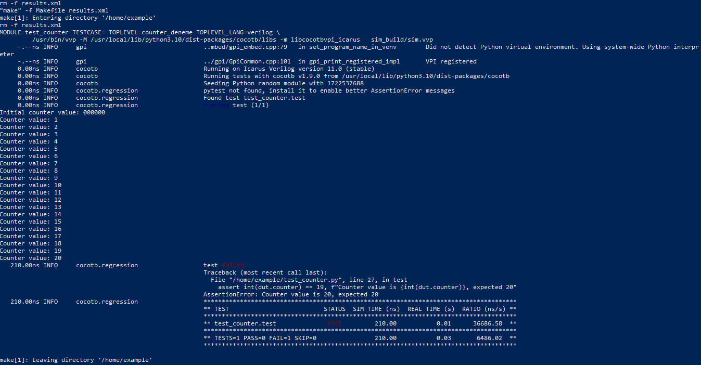
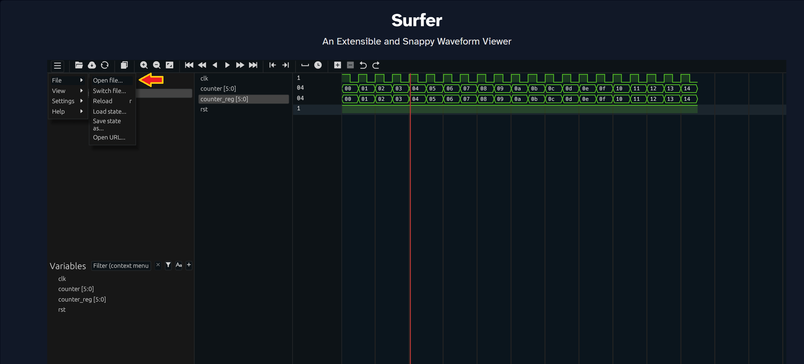

# COCOTB (Coroutine Based Cosimulation Test Bench)

Doğrulama, debug, test... FPGA tasarımında sadece ve sadece RTL kod yazıp çalışmasını beklemek çok zor. Yaptığımız projeler gereği tek seferde bir kodu çalıştırmamız imkansız değil fakat corner-case diyebileceğimiz koşullarda kodun çalışmasını sağlamak ayrı bir zorluk.

Bunu başarabilmek için kart üzerinde gerçek zamanlı testler öncesi yapacağımız adımlar çok önemli: Kodu doğrulamak ve recursive olarak kodu düzeltmek. Buna da aslında RTL doğrulama diyebiliriz.

Doğrulama konusunda UVM gibi çokça kullanılan bir yöntem var ama bu yazıda Python temelli `cocotb`'den bahsedeceğim. Evet, verilog, system-verilog veya VHDL ile yazılan bir doğrulamadan bahsetmiyorum. Tamamiyle Python kullanarak RTL tasarımınızı özgürce doğrulayabiliyorsunuz. Ayrıca kullanımı çok kolay.

Yazının devamında `cocotb` konusunda genel bilgilerden bahsettim. Sonrasında Windows bilgisayarıma nasıl kurduğumdan bahsettim. En son da örnek birkaç kullanım gösterdim.

Cocotb konusunda ileride örnek projeler üzerinden gösterimler yapmayı planlıyorum. Bu yazıyı bir giriş ve tanıtım olarak görebilirsiniz.

## Neden COCOTB?

Bu soruya verilebilecek birçok cevap var fakat en önemlilerini aşağıda
sıraladım:

- Python dili temel manada kullanım açısından öğrenmesi ve yazması kolay bir dil.
- `cocotb` ileri düzeyde Python bilgisi gerektirmiyor.
- Python'ın sağladığı çok geniş bir kütüphane içeriği var (numpy, pandas...
  gibi). RTL tabanlı bir doğrulama aracında kolayca yapamayacağınız işlemleri
  (rastgele sayı üretme, array yapıları, ethernet paketleri... vs.) Python'da çok kolay bir şekilde
  yapabilirsiniz.
- Jenkins entegrasyonu sağlaması adına built-in desteğine sahip yani git tabanlı
  uygulamalarda kolayca continuous integration (CI) sistemine cocotb'yi entegre
  edebilirsiniz.
- cocotb kullanırken ekstra RTL tabanlı wrapper dosya oluşturmanıza gerek
  yoktur.

## COCOTB Nasıl Çalışır?

`cocotb` ekstradan RTL kod gerektirmez fakat simülatör'e ihtiyaç duyar. Neden ihtiyaç duyduğunu aşağı kısımlarda açıkladım. Desteklenen simülatörleri aşağıda listeledim:

| Simülatörler                | Windows | Linux   |
| --------------------------- | :-----: | :-----: |
| Icarus Verilog              | ✔       | ✔      |
| GHDL                        | ❌      | ✔      |
| Aldex Riviera-PRO           | ✔       | ✔      |
| Synopsys VCS                | ❌      | ✔      |
| Cadence Incisive ve Xcelium | ❌      | ✔      |
| Verilator                   | ❌      | ✔      |
|Mentor Modelsim (DE ve SE)   | ✔       | ✔      |

cocotb oluşturmuş olduğu GPI ismi verilen soyut katman ve VPI-VHPI-FLI simülatör
arayüzlerini kullanarak Python kodu ile Design Under Test'i (DUT) birbirine bağlar. Burada DUT, test altındaki
tasarımı temsil etmektedir. Bu katmanları ayrıntılı bilmeye gerek yoktur fakat
merak edenler için aşağıda cocotb'nin nası çalıştığına dair bir figür
bulunmaktadır:


## COCOTB Kurulumu

Cocotb'yi Windows10'da çalıştırdığım için kurulum rehberini Windows için anlatacağım. Direkt olarak Windows'u kullanmak bana mantıklı gelmedi çünkü dependency açısından problemler oluşturabiliyor. Kişisel olarak bu tarz konularda çok fazla problem yaşadığım için `Docker Desktop` kullandım. `Docker`'ı en ince ayrıntısıyla öğrenmeme gerek kalmadan kullanabildim. Cocotb'yi kurabilmek için Docker'ın ne olduğunu bilmek yeterli. Docker en basit tanımıyla temelinde bir sanallaştırma yöntemi. Daha fazla bilgi için internette çok fazla kaynak bulunmaktadır fakat şimdilik o kısımlara değinmeyeceğim.

[Bu linkten](https://docs.docker.com/desktop/install/windows-install/) Docker Desktop indirilir. Sonrasında bilgisayara kurulur. Ben ayarları önerilende kullandım ve kurulumu bu şekilde yaptım. Sonrasında aşağıdaki komutu cmd ile çalıştırdım:

```bash
docker run -it -v C:\Users\yunus\Desktop\cocotb_deneme\:/home/example ubuntu:22.04
```

Yukarıdaki komut ile ubuntu 22.04 container'ını kullandım yani sanal olarak ubuntu 22.04'ü Windows10 işletim sistemli bilgisayarımda kullanabilir hale geldim. Ayrıca cocotb'yi çalışacağım bir Windows dizinini ubuntu container içerisinde bir dizine bağladım. Bu şekilde, Windows üzerinden yapacağım değişiklikler docker container içerisinde de yapılır.

Artık ubuntu içerisinde çalışabiliyoruz. Aşağıdakine benzer bir komut satırını görebiliriz:


Eğer cmd'yi kapadıktan sonra tekrar aynı docker container'ına bağlanmak istiyorsak aşağıdaki komutları sırasıyla başka bir cmd'de kullanabiliriz:

```bash
docker start "id"
docker attach "id"
```

`"id"` kısmına `Docker Desktop` uygulamasından bakılabilir. Docker Desktop uygulaması açılır, `Containers` kısmına girilir ve aşağıda mavi ok ile işaretlenen kısımdan ilgili container id kopyalanır.


Sonrasında cocotb kurmak için gerekli dependency'leri kurmamız gerekiyor. Bunun için aşağıdaki komutları kullanabiliriz:

```bash
apt-get update
apt-get upgrade
apt-get install make python3 python3-pip libpython3-dev
```

Artık gerekli ortamı kurduk. Sadece cocotb kütüphanesini ve herhangi bir simülatörü kurmamız gerekiyor. Ben verilog kullandığım için `iverilog` simülatörünü kullandım. Hem de ücretsiz bir simülatör. Kalan kurulumlar için aşağıdaki komutlar kullanılabilir:

```bash
pip install cocotb[bus]
apt install -y iverilog
```

VHDL içinse yine kullanması ücretsiz olan `GHDL`'i önerebilirim. Yukarıdaki kurulumlar sonrasında cocotb çalışacağımız dizine cd komutu ile gidebiliriz:

```bash
cd /home/example
```

## COCOTB - İlk Program

Temelde üç çeşit dosyaya ihtiyacımız var:

- verilog/vhdl kaynak dosyaları
- Python cocotb kodu
- Makefile

Kaynak dosyaları ve Python kodunun ne işe yaradığı anlaşılıyor fakat Makefile ne işe yarıyor? Makefile, simülatör ile Python cocotb kodu ve kaynak dosyaları arasında bir köprü görevi görüyor diyebilirim. İçerisinde kaynak dosyaları, Python kodu, top modül, simülatör ismi vs. gibi bilgiler yer alıyor.

İlk deneme için oluşturduğum projeyi ve dosyaları kısaca anlatayım.

- counter_deneme.v: Reset sonrası input clock'a göre output counter register sürekli artar.
- test_counter.py: cocotb test kodudur. Reset sonrası 20 clock cycle bekler ve counter değerinin 20 olup olmadığını kontrol eder.
- Makefile: Gerekli bilgilerin tutulduğu makefile dosyası

Önce make dosyasını paylaşıp neyin ne işe yaradığından bahsedeyim:

```make
SIM ?= icarus
TOPLEVEL_LANG ?= verilog

VERILOG_SOURCES = ./counter.v

TOPLEVEL = counter_deneme
MODULE = test_counter

include $(shell cocotb-config --makefiles)/Makefile.sim
```

- `SIM` ile simülatör tanımlanır. Örnek projede `icarus` yazılmıştır. `iverilog` aslında `icarus verilog` demektir.
- `TOPLEVEL_LANG` ile dil tanımlaması yapılır.
- `VERILOG_SOURCES` ile kaynak dosyalar eklenir. Birden fazla ise `VERILOG_SOURCES +=` ile tanımlanabilir.
- `TOPLEVEL` ile eklenen kaynak dosyalarından hangisinin top modül olduğu belirtilir.
- `MODULE` ile cocotb Python kodunun dosya ismi belirtilir.
- `include $(shell cocotb-config --makefiles)/Makefile.sim` satırı daha önce de bahsettiğim köprü işini halleder.

Aşağıda, kullanılan verilog kodu bulunmaktadır:

```verilog
// counter_deneme.v
module counter_deneme (
    input clk,
    input rst,

    output [5:0] counter
);

    reg [5:0] counter_reg = 0;

    always @(posedge clk) begin
        if (!rst) begin
            counter_reg <= 0;
        end
        else begin
            counter_reg <= counter_reg + 1;
        end
    end

    assign counter = counter_reg;

endmodule
```

Kodu anlaması çok kolay. Ama yine de kısaca bahsedeyim. Input clock var `clk` isminde. Output `counter` portu var. Her clock cycle'da `counter` 1 artıyor. Ayrıca `rst` var active-low şeklinde çalışan.

Son olarak cocotb Python kodunu ve hangi kod parçasının ne işe yaradığı ile ilgili kısımları aşağıda paylaştım:

```Python
# test_counter.py
import cocotb
from cocotb.clock import Clock
from cocotb.triggers import RisingEdge

@cocotb.test()
async def test(dut):
    # Create a 10ns period clock on port clk
    clock = Clock(dut.clk, 10, units="ns")
    cocotb.start_soon(clock.start())

    # Reset
    dut.rst.value = 0
    await RisingEdge(dut.clk)
    dut.rst.value = 1

    # Print initial values
    await RisingEdge(dut.clk)
    print(f"Initial counter value: {dut.counter.value}")
    
    # Run the simulation for 20 clock cycles
    for i in range(20):
        await RisingEdge(dut.clk)
        print(f"Counter value: {int(dut.counter)}")

    # Check the final counter value
    assert int(dut.counter) == 20, f"Counter value is {int(dut.counter)}, expected 20"
```

## Import

`cocotb`, `Clock`, ve `RisingEdge` modüllerini import ediyoruz:

- `cocotb`: Test framework'ünü ekleriz.
- `Clock`: Simülasyonda clock sinyali oluşturmak için kullanırız.
- `RisingEdge`: Belirtilen sinyalin yükselen kenarını beklemek için kullanırız.

## Decorator

`@cocotb.test()` dekoratörü ile test fonksiyonumuzu belirtiyoruz. Bu dekoratör, test fonksiyonunu bir cocotb test fonksiyonu olarak işaretler ve simülasyon sırasında çalıştırılmasını sağlar.

Bu şekilde birden fazla test fonksiyonu oluşturabiliyoruz. Test fonksiyonları sıralı bir şekilde çalışır.

Ayrıca; fonksiyon başına `async` ekleyerek `cocotb` testleri özelinde eş zamanlı çalışacak fonksiyonlar desteklenir. O yüzden eklenmesi gerekmektedir.

## Clock Üretme

```Python
# Create a 10ns period clock on port clk
clock = Clock(dut.clk, 10, units="ns")
cocotb.start_soon(clock.start())
```

Fonksiyon parametresi olarak tanımlanan `dut` ile modül içerisindeki sinyallere ve portlara erişmemiz mümkün. Bu ismi seçme sebebim `dut` ifadesinin açılımının `design under test` olması. Bunun yerine başka isim de seçilebilir. Genelde bu isim kullanılıyor.

Yukarıdaki kod snippet ile 10 nanosaniyelik periyoda sahip bir clock sinyali oluştururuz ve dut.clk portuna bağlarız.

`cocotb.start_soon(clock.start())` fonksiyonu ile clock üretme işi arka planda çalışır. Yani bir nevi thread gibi çalışır. Bu fonksiyonu, tanımladığımız başka fonksiyonlar için de kullanabiliriz.

## Await

```Python
# Print initial values
await RisingEdge(dut.clk)
print(f"Initial counter value: {dut.counter.value}")

# Run the simulation for 20 clock cycles
for i in range(20):
    await RisingEdge(dut.clk)
    print(f"Counter value: {int(dut.counter.value)}")
```

Herhangi bir event'in veya fonksiyonun bitmesini bekler. Yukarıdaki kodta clock sinyalinin yükselen kenarını bekler ve counter'ın başlangıç değerini ekrana yazdırır.

Ayrıca sonrasında, 20 clock döngüsü boyunca her clock sinyalinin yükselen kenarını bekler ve o anda counter değerini ekrana yazdırır.

Değer yazdırmak veya kullanmak içinse ilgili register/port'un sağına `.value` objesi eklenir. `dut.counter.value` buna bir örnektir.

## Input Portlara Değer Atama

```Python
# Reset
dut.rst.value = 0
await RisingEdge(dut.clk)
dut.rst.value = 1
```

Input portlara atamalar yapabiliyoruz. Bunu yapmak için `.value` objesini kullanırız. Sonrasında `await` ile bir sonraki clock cycle'a geçiş yapabiliriz.

Yukarıda `rst` sinyaline 0 sürülmüş, sonrasında 1 clock cycle beklenmiş ve 1 sürülerek reset durumundan çıkarılmıştır.

## Assert

```Python
# Check the final counter value
assert int(dut.counter) == 20, f"Counter value is {int(dut.counter)}, expected 20"
```

Simülasyonun sonunda counter'ın beklenen değere ulaşıp ulaşmadığı kontrol edilir. Kontrol etme kısmı `assert` ile yapılır. Aslında system verilog'taki assert ile aynı işleve sahiptir.

Eğer counter değeri 20 değilse, bir hata mesajı ile testin başarısız olduğu konsola yazdırılabilir.

## Çalıştırma

Gerekli üç dosyamız var. Tek yapmamız gereken `Makefile` dosyasının bulunduğu dizinde terminalden `make` komutunu çalıştırmak.

Örnek projede `make` çalıştırdıktan sonra aşağıdaki gibi bir çıktıyı terminalden görmek mümkün.


Kodun herhangi bir yerinde hata alınması durumunda o testten çıkılır ve bir sonraki test (eğer varsa) çalıştırılır.

Kodun fail vermesi adına en sonki kısımdaki `assert` kısmındaki 20 değerini 19 yaptım ve terminalde aşağıdaki çıktıyı elde ettim:



## Waveform - Surfer

Doğrulama yaparken fail verdi ve nereden kaynaklı olduğunu bulmaya çalışıyoruz. Python print fonksiyonlarıyla devam etmek verimsiz olabilir.

Doğrulama yaparken arka planda waveform oluşmasını sağlayabiliyoruz. Bunun için tek yapmamız gereken `make` ile `WAVES=1` kullanmak:

```bash
make WAVES=1
```

Komutu çalıştırdıktan sonra waveform, `Makefile` dosyasının yer aldığı dizinde `sim_build` dosyasının içerisinde `.fst` uzantısıyla oluşur.

Kolayca görüntüleyebilmek için `Surfer` kullandım çünkü online hizmeti de var. Bunun haricinde `GTKWave` de kullanılabilir. [Bu linkten](https://surfer-project.org) online bir şekilde waveform görüntüleyebiliyoruz.



Yukarıdaki görselde ok işareti ile gösterilen kısımdan `.fst` uzantılı dosya yüklenir. İstenilen sinyaller sol aşağıdan waveform'a eklenebilir.

## Son Notlar

Eğer RTL ile uğraşıyorsanız bir doğrulama aracınız olmalı. Birçok yönden kullanım kolaylığı açısından cocotb beni çok cezbetti. Bu yazı cocotb için bir giriş gibi. Kullanılabilecek başka bir sürü özelliği mevcut. Belki ileride tool hakkında bir seri yapabilirim.

## Referanslar

- [Cocotb Resmi Dokümanı](https://docs.cocotb.org/en/stable/index.html)
- [Cocotb Tutorial-Yazı-1](https://hardwareteams.com/docs/fpga-asic/cocotb/getting-started/)
- [Cocotb Tutorial-Yazı-2](https://learncocotb.com/docs/cocotb-tutorial/)
- [Cocotb Tutorial-Youtube](https://www.youtube.com/@learncocotb1560/videos)
