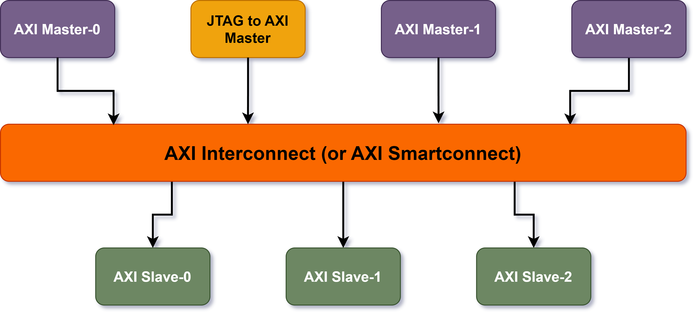
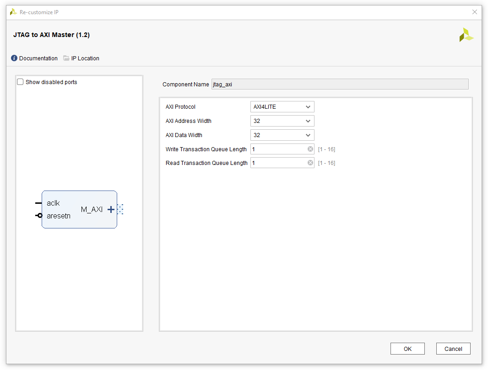
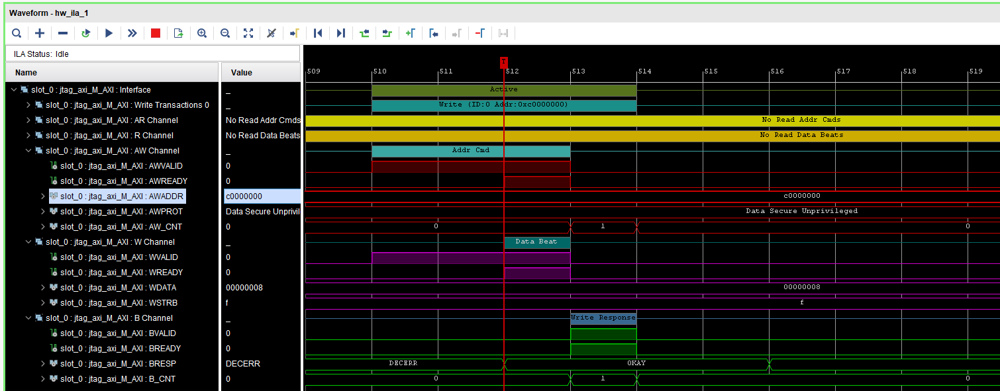
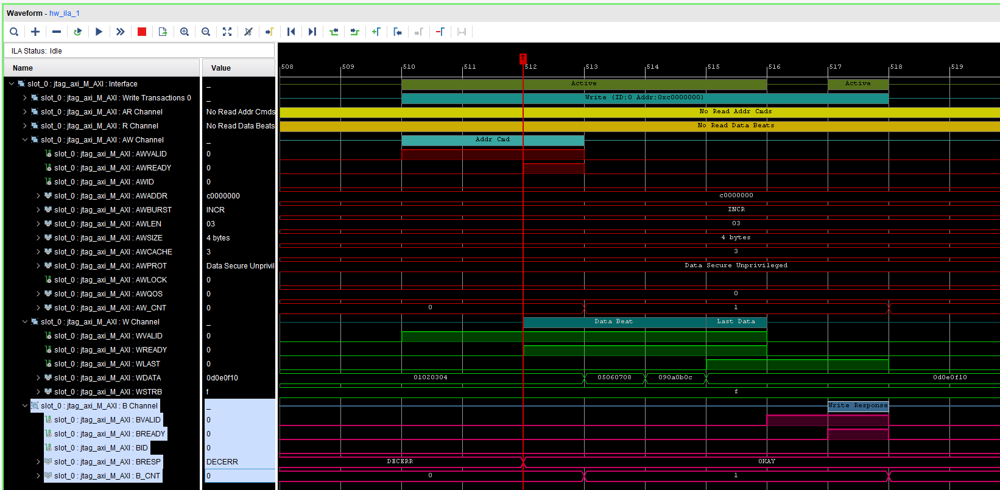
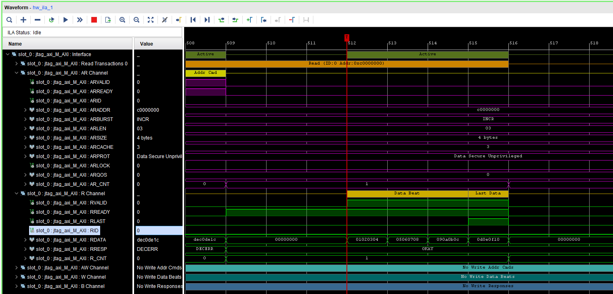

# JTAG to AXI Master IP

Xilinx'in `JTAG to AXI Master` isimli bir IP'si var. Literatürde gördüğüm kadarıyla yaygınca kullanılan bir IP değil. Esasında debug amaçlı tasarlanmış bir IP. Özellikle birden fazla adres alanına `AXI-Lite` veya `AXI Memory Mapped` arayüzü ile tek bir yerden erişmek için kullanılıyor. Aşağıda JTAG to AXI Master IP'sinin proje içerisinde nasıl duracağı ile ilgili örnek bir figür var:



Temelde, bu IP sayesinde Vivado harici herhangi bir programa gerek kalmadan; FPGA programlandıktan sonra `TCL konsolu` ile yukarıdaki görseldeki yapıyı koruyarak istediğimiz AXI-Lite veya AXI Memory Mapped slave arayüzüne erişebilmekteyiz.

## Motivasyon

Mesela; proje gereği **AXI IIC**, **AXI Quad SPI** ve **AXI Bram Controller** IP'lerini kullanıyoruz. Bu durumda her biri için bir adres **offset'i** belirleniyor (Vivado veya kullanıcı tarafından). Bu adresler dikkate alınarak projenin veya IP'lerin gereği olarak ilgili kısımlara veriler yazılır. Fakat henüz geliştirme aşamasında küçük denemeler yapabilmek için ilgili IP'ye AXI-Lite veya AXI Memory Mapped üzerinden erişmemiz ve yazma/okuma yapmamız gerekiyor. İşte JTAG to AXI Master IP'si sayesinde projeye dahil IP'lerin ilgili **AXI arayüzlerine** erişim sağlayabiliyoruz. Bunu yapmak için **Vitis** veya eski ismiyle **Xilinx SDK** veya işletim sistemi gibi kompleks ve başka programlara ihtiyaç duyan çözümlere gerek olmuyor.

## Diğer Alternatifler

Diğer alternatif çözümlerden de bahsetmek gerekir. Aşağıda diğer çözümler konusunda kısa anlatımlar yer alıyor:

- Xilinx Vitis (eski adıyla Xilinx SDK) programının **xsct** desteği bulunmakta. Bunun için `MicroBlaze Debug Module (MDM)` IP'sine Microblaze IP'si ile birlikte ihtiyaç var. Ayrıca ayarlarından `Enable AXI Memory Access From Debug` seçeneğini açmak gerekiyor. Çeşitli işlemler sonrası `mwr` veya `mrd` komutlarıyla ilgili adreslere gerekli veriler yazılabilir. Microblaze IP'si gerekli olduğu için ekstra bir dezavantaj ortaya çıkıyor.
- Microblaze IP'sini tasarıma ekleyip Xilinx Vitis (veya Xilinx SDK) üzerinden `Memory` ekranını açarak ilgili adreslere gerekli veriler GUI yardımıyla yazılabilir.
- İşletim sistemi kurabildiğimiz kartlarda `devmem` kullanılabilir.

## JTAG to AXI Master IP'sinin Avantajları

Bu IP'nin en büyük avantajı Vivado haricinde herhangi bir programa veya ekrana ihtiyaç duymamamız. Yani bu IP'yi Vivado yoluyla FPGA'i programladıktan sonra `tcl console` kısmını kullanarak kullanabiliyoruz.

Öte yandan, diğer çözümlerde ekstra olarak bir sürü işlem yapmak gerekebiliyor veya birden fazla programa ihtiyaç duyabiliyoruz. Bu yüzden erken aşama geliştirmelerinde bu IP'yi kullanmak çok mantıklı bir araç haline geliyor.

## Nasıl Kullanabiliriz

Öncelikle aşağıdakine benzer bir tasarımımız olması gerekir, yani içerisinde AXI ile haberleşebildiğimiz IP'lerimizin olması zorunlu.


Yukarıda `MICROBLAZE` ile belirtilen subblock içerisinde Microblaze ve diğer gerekli IP'ler bulunmaktadır. `MEMORY` ile belirtilen kısımda Block Memory Generator ve AXI BRAM controller IP'leri yer almaktadır.

Yeşil ile belirtilen IP, üzerine çalışacağımız IP yani JTAG to AXI Master IP'si. Fark edileceği üzere AXI ile erişebildiğimiz iki IP var. Biri AXI Quad SPI, diğeri ise MEMORY subblock'u.

Ayrıca AXI transactionları daha iyi gözlemleyebilmek adına `ILA` bağladım. Bu sayede AXI Memory Mapped arayüz ayarlandığında **burst** veri akışını doğrulayacağız. AXI-lite arayüz ayarında ise sadece veri akışını gözlemleyebileceğiz.

Aşağıda IP ayarları mevcut. Görüleceği üzere konfigüre etmesi çok kolay. Tek yapmamız gereken ihtiyaca göre AXI-Lite veya AXI Memory Mapped buslarından birini seçmek. Burst veri aktarımı isteniyorsa `AXI4` seçilmeli. Böyle bir istek veya gerek yoksa `AXI4LITE` seçilmesi IP'nin harcayacağı kaynak açısından daha verimli olacaktır.



Her ne kadar bu IP'yi erken aşama geliştirme aşamalarında kullansak da projenin son halinde de tasarım içerisinde bırakabiliriz. Mesela **Microblaze** kullandığımız bir proje düşünelim. Normalde projenin son halinde Vitis üzerinden yazacağımız kod ile AXI Quad SPI IP'sini konfigüre edebiliriz veya veri okuma-yazma yapabiliriz. Yine de bu IP, proje içerisinde Microblaze üzerinde çalışan kod ile birlikte bulunabilir. Böylece geliştirme aşaması sonrası çıkabilecek problemlerde hızlıca kullanabileceğimiz bir alternatif olabilir.

Burada **ILA** veya **VIO'dan** farkımız çok daha az kaynak harcayarak gerçek zamanlı (real-time) debugging yapabilmemiz ve AXI gibi fazlaca portu bulunan bir bus'ı rahatlıkla sürebilmemiz.

Aşağıda örnek projeye ait adres editör kısmını paylaştım. Gerçek zamanlı denemeleri yaparken buradaki adresleri offset olarak kullanacağız.


Tasarıma ait bitstream oluşturulduktan ve Vivado Hardware Manager yöntemi ile FPGA programlandıktan sonra soldaki `Hardware` kısmı aşağıdaki gibi gözükür. İkinci sırada da gözüktüğü üzere JTAG to AXI Master IP'sini hardware tanımaktadır. Bu durum ILA ve VIO gibi IP'lerde de mevcuttur.


Bu noktadan sonra aşağıda bulunan adımları takip ederek bağlı olduğumuz `AXI Interconnect`'e (veya AXI Smartconnect) bağlı IP'lere erişebilmemiz mümkün.

## AXI-Lite Arayüz Ayarı

Block tasarıma eklediğimiz JTAG to AXI Master IP'sinin `AXI Protocol` ayarı `AXI4LITE` yapılmalıdır. Bu haliyle sentezlenen tasarım ile FPGA programlandıktan sonra aşağıdaki komutlar girilerek AXI-Lite arayüzünden ilgili adrese yazma işlemi yapılabilir, yani write transaction gerçekleştirilir.

```tcl
set addr_bram 0xC0000000
set bram_wt bram_wt
create_hw_axi_txn $bram_wt [get_hw_axis hw_axi_1] -type write -address $addr_bram -data {0x00000008} -force
run_hw_axi [get_hw_axi_txns $bram_wt]
```

Aşağıda her bir komutun ne anlama geldiği belirtilmiştir:

- `set addr_bram 0xC0000000`: Adres tanımlaması bir değişkene atanır. Bu örnekte BRAM'in offset adresi verilmiştir.
- `set bram_wt bram_wt`: Transaction objesi tanımlanmış ve bir değişkene atanmıştır.
- `create_hw_axi_txn...`: Write transaction oluşturulur. Henüz veri gönderme işlemi vs. yapılmaz. Yapılacak transaction ile ilgili tanımlamalar yapılır ve transaction objesine tanıtılır.
- `run_hw_axi...`: Write transaction gerçekleştirilir.

Komutları çalıştırdıktan sonra TCL satırları aşağıdaki gibi gözükür:


Ayrıca, oluşturduğumuz bu transaction ILA'da aşağıdaki gibi gözükmekte:



Aşağıda read transaction için kullanılması gereken komutlar aşağıda belirtilmiştir:

```tcl
set addr_bram 0xC0000000
set bram_rt bram_rt
create_hw_axi_txn $bram_rt [get_hw_axis hw_axi_1] -type read -address $addr_bram -force
run_hw_axi [get_hw_axi_txns $bram_rt]
```

Komutları çalıştırdıktan sonra TCL satırları aşağıdaki gibi gözükür:


Ayrıca, oluşturduğumuz bu transaction ILA'da aşağıdaki gibi gözükmekte:


Yukarıdaki görsellerde de görüleceği üzere `0xC0000000` adresine `00000008` değeri yazılıp sonrasında aynı adres okunmuştur. Yazılan ve okunan değerin aynı olduğu ispatlanmıştır.

## AXI Memory Mapped Ayarı

Block tasarıma eklediğimiz JTAG to AXI Master IP'sinin `AXI Protocol` ayarı `AXI4` yapılmalıdır. Bu haliyle sentezlenen tasarım ile FPGA programlandıktan sonra aşağıdaki komutlar girilerek AXI Memory Mapped arayüzünden ilgili adrese yazma işlemi yapılabilir, yani write transaction gerçekleştirilir.

```tcl
set addr_bram 0xC0000000
set bram_wt bram_wt
create_hw_axi_txn $bram_wt [get_hw_axis hw_axi_1] -type write -address $addr_bram -data {0x01020304 0x05060708 090a0b0c 0d0e0f10} -len 4 -force
run_hw_axi [get_hw_axi_txns $bram_wt]
```

Yukarıdaki komutlarda AXI-Lite ayarından farklı olarak `-len 4` var ve `-data` kısmının yanında birden fazla veri bulunuyor. `-len` ile yazacağımız kısım yazılacak/okunacak veri saysını belirtir. `-data` ile de ilgili adreslere yazacağımız veriler adres sırasına göre belirtilir. Yukarıdaki örnekte ilk adrese (`0xC0000000` adresine) `0x01020304` değeri yazılmıştır.

Komutları çalıştırdıktan sonra TCL satırları aşağıdaki gibi gözükür:


Ayrıca, oluşturduğumuz bu transaction ILA'da aşağıdaki gibi gözükmekte. AXI-Lite arayüzünden farklı olarak burst veri akışı gerçekleşir:



Aşağıda read transaction için kullanılması gereken komutlar aşağıda belirtilmiştir:

```tcl
set addr_bram 0xC0000000
set bram_rt bram_rt
create_hw_axi_txn $bram_rt [get_hw_axis hw_axi_1] -type read -address $addr_bram -len 4 -force
run_hw_axi [get_hw_axi_txns $bram_rt]
```

Komutları çalıştırdıktan sonra TCL satırları aşağıdaki gibi gözükür:


Ayrıca, oluşturduğumuz bu transaction ILA'da aşağıdaki gibi gözükmekte:



Yazdığımız verileri aynı şekilde okuyabildik.

## Son Görüşler

IP'ye ilk bakarken çok önyargılıydım. `xsct`, `Vitis` gibi çözümler dururken mantıksız gelmişti ama kullandıkça fark ettim ki geliştirmenin ilk aşamalarında kullanışlı olabilir. Kullanması ve öğrenmesi de gayet kolay. Sadece Vivado ile AXI arayüzü olan IP'leri konfigüre edebiliyoruz veya ilgili kısımlarına veri yazabiliyoruz.

Kısa tcl kodları yazarak birçok işi diğer çözümler veya programlar olmadan yapabiliriz. Sonuç olarak kullanmaya değer buldum.

## Referanslar

- [JTAG to AXI Master Kullanım Videosu](https://www.xilinx.com/video/software/jtag-to-axi-master-core.html)
- [Xilinx JTAG to AXI Master Dokümanı](https://docs.amd.com/v/u/en-US/pg174-jtag-axi)
- [JTAG to AXI Master Örnek Kullanımı](https://xilinx-wiki.atlassian.net/wiki/spaces/A/pages/64488613/Using+the+JTAG+to+AXI+to+test+Peripherals+in+Zynq+Ultrascale)
